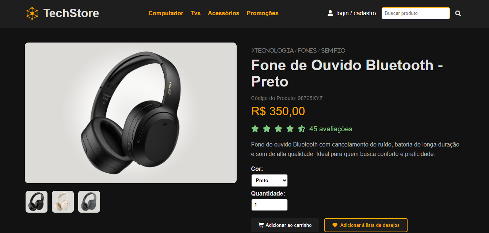
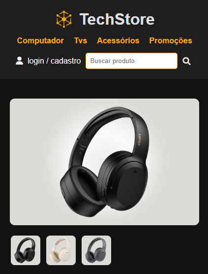
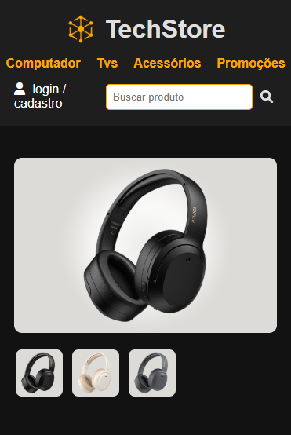

  <h2 align="center">Tech Store - E-commerce</h2>

  

Este projeto é uma tela de produto para um site de e-commerce, desenvolvido utilizando **HTML** e **CSS**, como parte do meu processo de aprendizado e aprimoramento na área de front-end.
Foi um grande desafio criar essa tela, principalmente no que diz respeito à responsividade e organização dos elementos, mas também foi uma experiência extremamente valiosa e um ótimo aprendizado para minha evolução como desenvolvedora.
   
   
 <a href="https://moniquecarvalho.github.io/site-tech-store"><strong>Visualizar o projeto »</strong></a> 
   
   
  

<b>Versão Web

   
  
**Descrição:**  
Tela de produto exibida em resolução desktop, com todos os elementos bem distribuídos e aproveitamento completo do espaço da tela.

 

## 📱 Responsividade

 Totalmente responsivo para:
- **Celulares**
- **Tablets**
- **Desktops**

## Funcionalidades

-  Exibição de informações do produto
-  **Seleção de cor** através de um `label`
-  Escolha da **quantidade** do produto
-  **Botão "Adicionar ao Carrinho"** para simular a ação de compra
-  Layout responsivo e adaptável para diferentes tamanhos de tela

 

## 📱 Resolução 425px (Tablet / Celular maior)

 
**Descrição:**  
Layout ajustado para resolução de 425px, com reorganização dos elementos para melhor visualização e usabilidade em telas menores.

 

## 📱 Resolução 375px (Celular)

**Descrição:**  
Visualização otimizada para celulares com resolução de 375px, mantendo a boa leitura, espaçamento e funcionalidades acessíveis.

 

## 🚀 Tecnologias Utilizadas

- **HTML5**
- **CSS3**

 

## 💡 Sobre Mim

Estou atualmente em processo de aprendizado e este projeto faz parte dos meus estudos para me tornar uma desenvolvedora front-end cada vez mais preparada para o mercado.  

Fique à vontade para deixar seu feedback ou sugestões!
